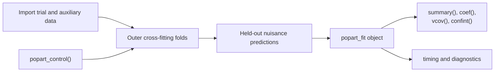

---
output:
  github_document:
    html_preview: false
always_allow_html: true
---

<!-- README.md is generated from README.Rmd. Edit README.Rmd, then render it. -->

# popart

`popart` is an R package for analyzing a randomized-trial data frame together
with an auxiliary data frame. The installed package provides a small analysis
API; data generation, Monte Carlo experiments, and the global scheduler remain
in the repository-only [`simulation/`](simulation/) directory.

## Mathematical formulation

Let $S=1$ identify an observation from the trial and $S=0$ an observation
from the auxiliary sample. Let $A\in\{0,1\}$ denote treatment, $R$ response,
$C$ censoring, $Y$ the observed binary outcome, and $L$ the baseline
covariates shared by the two data sources. The auxiliary sample supplies the
target-population distribution of $L$, with optional sampling weights
$\omega$; it does not need to contain outcomes.

The treatment-specific target mean is

$$
\eta(a)=\operatorname{E}\{Y(a)\}, \qquad a\in\{0,1\}.
$$

The outcome nuisance function is learned among observed trial participants:

$$
\mu_a(l)
=\operatorname{E}\left(Y\mid A=a,S=1,R=1,C=0,L=l\right).
$$

To estimate the probability of appearing as an observed trial participant,
define $Q=S R(1-C)$. For each treatment arm $a$, combine observations with
$Q=1,A=a$ and auxiliary observations with $S=0$, and let

$$
g_a(l)=\Pr^*(Q=1\mid L=l),
\qquad
o_a(l)=\frac{g_a(l)}{1-g_a(l)}.
$$

Here $\Pr^*$ refers to that arm-specific restricted sample. Under unit
auxiliary weights, the paper's joint selection probability is proportional to
these odds:

$$
\pi_a(l)
=\Pr(A=a,R=1,C=0\mid L=l)
=\frac{n_{\mathrm{aux}}}{n}\,o_a(l).
$$

`popart` uses the equivalent Hájek-normalized form. Define

$$
\widehat H_a
=\sum_{i:Q_i=1,A_i=a}\frac{1}{\widehat o_a(L_i)},
\qquad
W_{\mathrm{aux}}=\sum_{i:S_i=0}\omega_i.
$$

The auxiliary-data-assisted AIPW estimator is

$$
\widehat\eta_{\mathrm{AIPW}}(a)
=
\frac{1}{\widehat H_a}
\sum_i
\frac{\mathbb{1}(S_i=1,R_i=1,C_i=0,A_i=a)}
     {\widehat o_a(L_i)}
\left\{Y_i-\widehat\mu_a(L_i)\right\}
+
\frac{1}{W_{\mathrm{aux}}}
\sum_i
\mathbb{1}(S_i=0)\omega_i\widehat\mu_a(L_i).
$$

The second term standardizes predicted outcomes over the auxiliary sample; the
first term uses weighted trial residuals to correct outcome-model error. Under
the identification and regularity conditions in the accompanying work, this
construction is doubly robust: consistency requires a correct outcome model
or a correct joint selection model, rather than necessarily both.

The reported causal contrasts are

$$
\mathrm{RD}=\eta(1)-\eta(0),
\qquad
\mathrm{RR}=\frac{\eta(1)}{\eta(0)}.
$$

The package estimates the covariance of $\widehat\eta(0)$ and
$\widehat\eta(1)$ from their empirical influence-function contributions and
uses the delta method for the risk-difference and risk-ratio standard errors.

## Package workflow



## Main functions

| Function | Purpose |
|---|---|
| `fit_popart()` | Fit the trial-only and trial-plus-auxiliary analyses |
| `popart_control()` | Select nuisance learners and set tuning, random seeds, worker counts, and memory options |
| `summary()`, `coef()`, `vcov()`, `confint()` | Inspect estimates and uncertainty |
| `as.data.frame()` | Return the complete results table |

## Installation

From a cloned source checkout, run this in R from the repository root:

```r
install.packages(".", repos = NULL, type = "source")
```

`popart` requires R 4.1 or later. Package dependencies are listed in
[`DESCRIPTION`](DESCRIPTION). The optional `xgboost` package is required only
when at least one nuisance model selects the `"xgboost"` learner.

## Quick start

The repository includes fixed synthetic CSV files for this example. They are
not installed as package data.

```r
library(popart)

trial <- read.csv("simulation/data/example_trial.csv")
auxiliary <- read.csv("simulation/data/example_auxiliary.csv")

fit <- fit_popart(
  trial_data = trial,
  auxiliary_data = auxiliary,
  outcome = "outcome",
  treatment = "treatment",
  response = "responded",
  censoring = "censored",
  covariates = c(
    "baseline_risk",
    "baseline_binary",
    "baseline_score_1",
    "baseline_score_2"
  ),
  auxiliary_weight = "survey_weight",
  treatment_values = c(0, 1)
)

summary(fit)
coef(fit, estimator = "trial_auxiliary")
confint(fit, estimator = "trial_auxiliary")
```

For an applied analysis, import the two data frames from a CSV, database, or
another source and replace the example column names. `fit_popart()` accepts
data frames rather than file paths.

## Inputs

| Input | Required columns |
|---|---|
| `trial_data` | Outcome, two-level treatment, response indicator, censoring indicator, and baseline covariates |
| `auxiliary_data` | The same baseline covariates and an optional nonnegative sampling-weight column |

Outcome, response, and censoring variables must be binary. Response uses 1 for
responded and censoring uses 1 for censored. The outcome may be missing only
when it is unobserved, and censoring may be missing for nonresponders.
Covariates must be numeric or logical, finite, nonmissing, and present in both
data frames.

## Outputs

Every `popart_fit` object contains results labeled `trial_only` and
`trial_auxiliary`. Each label includes the control-arm mean, treated-arm mean,
risk difference, and risk ratio.

| Object component | Contents |
|---|---|
| `estimates` | Point estimates, standard errors, and confidence limits |
| `variance`, `covariance`, `full_covariance` | Variance and covariance results |
| `fit_diagnostics` | Outer-fold labels, learner names, fit sizes, tuning values, timings, and worker process IDs |
| `diagnostics` | Sample and outer-fold sizes, prediction ranges, weight scaling, and messages |
| `nuisance_fits` | HAL or XGBoost objects grouped by outer fold when explicitly retained; otherwise `NULL` |
| `control`, `columns`, `call` | Reproducibility information for the analysis |

## Computation controls

```r
# CPU-aware default
control <- popart_control()

# Explicit serial execution for a memory-constrained computer
serial_control <- popart_control(n_fit_workers = 1L, n_cv_workers = 1L)

# Use HAL for the outcome and censoring models, and XGBoost for Q0 and Q1.
mixed_control <- popart_control(
  nuisance_models = c(
    outcome = "hal",
    censoring = "hal",
    selection_control = "xgboost",
    selection_treated = "xgboost"
  )
)
```

| Control | Default | Meaning |
|---|---|---|
| `crossfit_folds` | `3L` | Outer folds used to generate out-of-fold nuisance predictions; set to `1L` to disable |
| `nuisance_models` | all `"hal"` | Named learner assignment for outcome, censoring, Q0, and Q1; supports `"hal"` and `"xgboost"` |
| `n_fit_workers` | `"auto"` | Complete nuisance fits that may run concurrently; automatic mode uses `max(1, min(4, available_cpu_slots - 2))` |
| `n_cv_workers` | `1L` | Workers used across CV folds inside one HAL fit |
| `n_cv_folds` | `3L` | Cross-validation folds per HAL fit |
| `n_lambda_values` | `50L` | Lasso penalty values per HAL fit |
| `num_knots` | `c(5L, 3L)` | HAL knot counts |
| `xgboost_nrounds` | `100L` | Boosting rounds for XGBoost fits |
| `xgboost_max_depth` | `6L` | Maximum XGBoost tree depth |
| `xgboost_learning_rate` | `0.3` | XGBoost learning rate |
| `keep_nuisance_fits` | `FALSE` | Do not retain completed nuisance-model objects unless requested |

Workers are R processes scheduled over the logical CPU slots available to R.
Only one parallel level is used at a time: either complete fits or the CV folds
inside a fit. With the default three-fold outer cross-fitting, one analysis
queues 12 complete nuisance fits (four model types in each fold). Each HAL fit
still uses the separate three-fold internal CV to choose its lasso penalty.
XGBoost fits do not use this HAL CV; they use the explicit boosting settings
above and one CPU thread per complete fit so that fit-level scheduling remains
in control of total parallelism. The `selection_control` and
`selection_treated` entries are the Q0 and Q1 models, respectively.

## Simulation

The [`simulation/`](simulation/) directory is excluded from the installed
package. It provides the research and teaching workflow used to generate data,
run Monte Carlo experiments, save progress, and create reports.
The repository-only plotting workflow also requires `legendry` for the nested
sample-size axes used in the manuscript figures.

| Location | Contents |
|---|---|
| `simulation/R/` | Data generation, reference analysis, global scheduling, persistence, and reporting functions |
| `simulation/data/` | Fixed synthetic CSV files used by the quick start |
| `simulation/scripts/` | Command-line entry points for running and analyzing simulations |
| `simulation/tests/` | Formal-package versus reference-code equivalence check |
| `simulation/results/` | Ignored local caches, checkpoints, result tables, reports, and figures |

### Monte Carlo results (10,000 replicates)

<!--
Insert the final Longleaf figures and a concise interpretation here. This
README intentionally reads saved results; rendering it must not rerun the
10,000-replicate simulation.
-->

### Scheduler workflow


The scheduler uses one global HAL-fit limit across active replicates and sample
size combinations. When a slot becomes free, it receives the next ready fit.
By default, two detected logical CPU slots are reserved for the operating
system, each HAL fit uses one CV worker, and cached or checkpointed work can be
reused after an interrupted run.

### Run a Monte Carlo study

Run these commands from the repository root:

```sh
# Inspect the planned resource allocation without fitting models.
Rscript simulation/scripts/run_monte_carlo.R --n-trial 200,500 --n-auxiliary 200,500 --replicates 20 --dry-run

# Run the study and write results, a report, and figures.
Rscript simulation/scripts/run_monte_carlo.R --n-trial 200,500 --n-auxiliary 200,500 --replicates 20 --run-id local_mc20

# Recreate the report and figures from saved results.
Rscript simulation/scripts/analyze_results.R --run-id local_mc20

# Compare the installed API with the preserved reference implementation.
Rscript simulation/tests/formal_api_equivalence.R
```

Use `--help` to list all Monte Carlo options, including explicit CPU limits,
CV settings, cache locations, resume behavior, and output directories.

## Documentation

- Open the installed tutorial with
  `vignette("getting-started", package = "popart")`.
- Read the source version at
  [`vignettes/getting-started.Rmd`](vignettes/getting-started.Rmd).
- See [`man/fit_popart.Rd`](man/fit_popart.Rd) and
  [`man/popart_control.Rd`](man/popart_control.Rd) for the complete API.

## References

<!-- References will be added after publication. -->

## License

The current [`LICENSE`](LICENSE) is a source-availability notice, not a public
redistribution license. Confirm the upstream research-code terms before public
release or redistribution.
