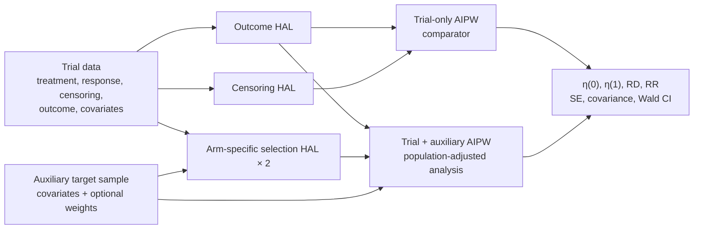

# popart

**Population-augmented analysis of randomized trials with differential
nonresponse**

`popart` combines a two-arm randomized-trial sample with an auxiliary
covariate sample from the target population. It implements the augmented
inverse probability weighting (AIPW) structure described by Richardson,
Shook-Sa, and Hudgens using highly adaptive lasso (HAL) nuisance regressions.

The package estimates the population-average risks
$\eta(0) = E\{Y(0)\}$ and $\eta(1) = E\{Y(1)\}$, their risk difference and risk
ratio, and corresponding standard errors, covariance matrices, Wald confidence
intervals, and diagnostics.

## Method



Both analyses use the same outcome regression. Their difference is the target
population used for standardization and the way incomplete observation is
handled:

| Returned estimator | Information used | Role |
|---|---|---|
| `trial_only` | Responding trial sample; treatment randomization and censoring adjustment | Comparator that does not correct the target-population shift caused by differential response |
| `trial_auxiliary` | Observed trial outcomes plus the auxiliary covariate distribution and arm-specific selection odds | Population-augmented analysis that adjusts for differential nonresponse and censoring under the identifying assumptions |

## Installation

From a cloned source checkout, run this in R from the repository root:

```r
install.packages(".", repos = NULL, type = "source")
```

`popart` requires R 4.1 or later. Its package dependencies, including
[`hal9001`](https://github.com/tlverse/hal9001), are listed in
[`DESCRIPTION`](DESCRIPTION).

## Quick start

The repository includes fixed synthetic CSV files for this example. They are
teaching fixtures and are not installed as package data.

```r
library(popart)

trial <- read.csv("simulation/data/example_trial.csv")
auxiliary <- read.csv("simulation/data/example_auxiliary.csv")

fit <- fit_popart(
  trial_data = trial,
  auxiliary_data = auxiliary,
  outcome = "outcome",
  treatment = "treatment",
  response = "responded",
  censoring = "censored",
  covariates = c(
    "baseline_risk",
    "baseline_binary",
    "baseline_score_1",
    "baseline_score_2"
  ),
  auxiliary_weight = "survey_weight",
  treatment_values = c(0, 1)
)

summary(fit)
coef(fit, estimator = "trial_auxiliary")
confint(fit, estimator = "trial_auxiliary")
```

For an applied analysis, first import a CSV, database table, or another data
source as a data frame, then use the same interface. `fit_popart()` does not
read file paths or generate data.

## Data and results

| Data frame | Required content |
|---|---|
| `trial_data` | Binary outcome, treatment, response indicator, censoring indicator, and baseline covariates |
| `auxiliary_data` | The same baseline covariates and, optionally, a nonnegative sampling-weight column; no treatment or outcome data are required |

Response uses 1 for responded and censoring uses 1 for censored. The outcome
may be missing only when it is unobserved; censoring may be missing for
nonresponders. Covariates must be numeric or logical, finite, nonmissing, and
present in both data frames. Encode categorical variables before fitting.

The returned `popart_fit` object contains four parameters for each estimator:

| Parameter | Definition |
|---|---|
| `mean_control` | $\eta(0)$ |
| `mean_treated` | $\eta(1)$ |
| `risk_difference` | $\eta(1) - \eta(0)$ |
| `risk_ratio` | $\eta(1) / \eta(0)$ |

Standard R methods are available: `print()`, `summary()`, `coef()`, `vcov()`,
`confint()`, `nobs()`, and `as.data.frame()`.

## Computation

`popart_control()` manages HAL tuning, reproducibility, memory, and one level
of parallelism at a time.

| Control | Default | Meaning |
|---|---|---|
| `n_fit_workers` | `"auto"` | Run up to `max(1, min(4, available_cpu_slots - 2))` complete HAL fits concurrently |
| `n_cv_workers` | `1L` | Workers used across CV folds inside one HAL fit |
| `n_cv_folds` | `3L` | Cross-validation folds per HAL fit |
| `num_knots` | `c(5L, 3L)` | HAL knot counts |
| `keep_nuisance_fits` | `FALSE` | Return estimates and diagnostics without retaining large completed `cv.glmnet` objects |

```r
# CPU-aware default
control <- popart_control()

# Explicit serial execution for a memory-constrained computer
serial_control <- popart_control(n_fit_workers = 1L, n_cv_workers = 1L)
```

Workers are R processes scheduled over the logical CPU slots available to R;
they are not guaranteed dedicated physical cores. If CV parallelism is set
above one while fit workers remain automatic, complete fits become serial to
avoid nested parallelism.

## Scope and assumptions

The analysis requires a well-defined randomized treatment, treatment and
uncensored-response positivity, conditional exchangeability of response and
censoring given treatment and baseline covariates, and trial and auxiliary
samples that correspond to the same target population (with appropriate
auxiliary weights when needed).

The motivating manuscript studies cluster-randomized trials. The current API
has no cluster identifier and does not provide cluster-robust inference; shared
cluster-level covariates can be supplied as baseline covariates repeated on
individual rows. The current package implements the AIPW analyses above, not
the manuscript's separate g-formula or IPW estimators, and does not return an
odds ratio.

HAL is an implementation choice in this package. The manuscript is an
unpublished draft and should not be read as establishing semiparametric
efficiency or unrestricted double-robust theory for this particular HAL
implementation.

## Documentation and reproducibility

- Start with the [getting-started vignette](vignettes/getting-started.Rmd), or
  run `vignette("getting-started", package = "popart")` after installation.
- See the [`fit_popart()`](man/fit_popart.Rd) and
  [`popart_control()`](man/popart_control.Rd) reference pages for the complete
  interface.
- Repository-only data generation, Monte Carlo experiments, checkpoints,
  reporting, and the cross-replicate global HAL scheduler live in
  [`simulation/`](simulation/). They are excluded from the installed package.

## References

- Richardson, B. D., Shook-Sa, B. E., and Hudgens, M. G. (n.d.). *Causal
  Inference from Cluster-Randomized Trials with Differential Nonresponse*.
  Unpublished manuscript submitted to *Biometrics*.
- Hejazi, N. S., Coyle, J. R., and van der Laan, M. J. (2020). `hal9001`:
  Scalable highly adaptive lasso regression in R. *Journal of Open Source
  Software*, 5(53), 2526.
  [doi:10.21105/joss.02526](https://doi.org/10.21105/joss.02526).

## License

The current [`LICENSE`](LICENSE) is a source-availability notice, not a public
redistribution license. Confirm the upstream research-code terms and replace
the notice with a compatible license before public release or redistribution.
