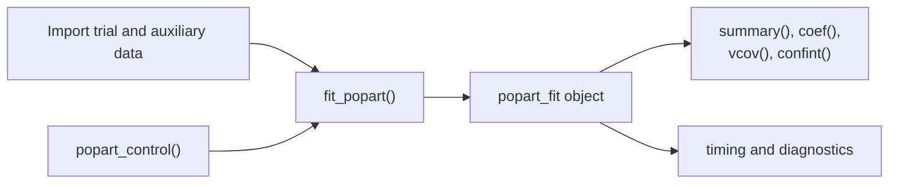
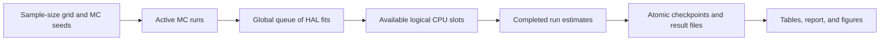

# popart

`popart` is an R package for analyzing a randomized-trial data frame together
with an auxiliary data frame. The installed package provides a small analysis
API; data generation, Monte Carlo experiments, and the global scheduler remain
in the repository-only [`simulation/`](simulation/) directory.

## Package workflow



## Main functions

| Function | Purpose |
|---|---|
| `fit_popart()` | Fit the trial-only and trial-plus-auxiliary analyses |
| `popart_control()` | Set HAL tuning, random seeds, worker counts, and memory options |
| `summary()`, `coef()`, `vcov()`, `confint()` | Inspect estimates and uncertainty |
| `as.data.frame()` | Return the complete results table |

## Installation

From a cloned source checkout, run this in R from the repository root:

```r
install.packages(".", repos = NULL, type = "source")
```

`popart` requires R 4.1 or later. Package dependencies are listed in
[`DESCRIPTION`](DESCRIPTION).

## Quick start

The repository includes fixed synthetic CSV files for this example. They are
not installed as package data.

```r
library(popart)

trial <- read.csv("simulation/data/example_trial.csv")
auxiliary <- read.csv("simulation/data/example_auxiliary.csv")

fit <- fit_popart(
  trial_data = trial,
  auxiliary_data = auxiliary,
  outcome = "outcome",
  treatment = "treatment",
  response = "responded",
  censoring = "censored",
  covariates = c(
    "baseline_risk",
    "baseline_binary",
    "baseline_score_1",
    "baseline_score_2"
  ),
  auxiliary_weight = "survey_weight",
  treatment_values = c(0, 1)
)

summary(fit)
coef(fit, estimator = "trial_auxiliary")
confint(fit, estimator = "trial_auxiliary")
```

For an applied analysis, import the two data frames from a CSV, database, or
another source and replace the example column names. `fit_popart()` accepts
data frames rather than file paths.

## Inputs

| Input | Required columns |
|---|---|
| `trial_data` | Outcome, two-level treatment, response indicator, censoring indicator, and baseline covariates |
| `auxiliary_data` | The same baseline covariates and an optional nonnegative sampling-weight column |

Outcome, response, and censoring variables must be binary. Response uses 1 for
responded and censoring uses 1 for censored. The outcome may be missing only
when it is unobserved, and censoring may be missing for nonresponders.
Covariates must be numeric or logical, finite, nonmissing, and present in both
data frames.

## Outputs

Every `popart_fit` object contains results labeled `trial_only` and
`trial_auxiliary`. Each label includes the control-arm mean, treated-arm mean,
risk difference, and risk ratio.

| Object component | Contents |
|---|---|
| `estimates` | Point estimates, standard errors, and confidence limits |
| `variance`, `covariance`, `full_covariance` | Variance and covariance results |
| `fit_diagnostics` | HAL fit sizes, timings, selected lambdas, and worker process IDs |
| `diagnostics` | Sample sizes, prediction ranges, weight scaling, and messages |
| `nuisance_fits` | Fitted HAL objects when explicitly retained; otherwise `NULL` |
| `control`, `columns`, `call` | Reproducibility information for the analysis |

## Computation controls

```r
# CPU-aware default
control <- popart_control()

# Explicit serial execution for a memory-constrained computer
serial_control <- popart_control(n_fit_workers = 1L, n_cv_workers = 1L)
```

| Control | Default | Meaning |
|---|---|---|
| `n_fit_workers` | `"auto"` | Complete HAL fits that may run concurrently; automatic mode uses `max(1, min(4, available_cpu_slots - 2))` |
| `n_cv_workers` | `1L` | Workers used across CV folds inside one HAL fit |
| `n_cv_folds` | `3L` | Cross-validation folds per HAL fit |
| `n_lambda_values` | `50L` | Lasso penalty values per HAL fit |
| `num_knots` | `c(5L, 3L)` | HAL knot counts |
| `keep_nuisance_fits` | `FALSE` | Do not retain completed `cv.glmnet` objects unless requested |

Workers are R processes scheduled over the logical CPU slots available to R.
Only one parallel level is used at a time: either complete fits or the CV folds
inside a fit.

## Simulation

The [`simulation/`](simulation/) directory is excluded from the installed
package. It provides the research and teaching workflow used to generate data,
run Monte Carlo experiments, save progress, and create reports.

| Location | Contents |
|---|---|
| `simulation/R/` | Data generation, reference analysis, global scheduling, persistence, and reporting functions |
| `simulation/data/` | Fixed synthetic CSV files used by the quick start |
| `simulation/scripts/` | Command-line entry points for running and analyzing simulations |
| `simulation/tests/` | Formal-package versus reference-code equivalence check |
| `simulation/results/` | Ignored local caches, checkpoints, result tables, reports, and figures |

### Scheduler workflow



The scheduler uses one global HAL-fit limit across active replicates and sample
size combinations. When a slot becomes free, it receives the next ready fit.
By default, two detected logical CPU slots are reserved for the operating
system, each HAL fit uses one CV worker, and cached or checkpointed work can be
reused after an interrupted run.

### Run a Monte Carlo study

Run these commands from the repository root:

```sh
# Inspect the planned resource allocation without fitting models.
Rscript simulation/scripts/run_monte_carlo.R --n-trial 200,500 --n-auxiliary 200,500 --replicates 20 --dry-run

# Run the study and write results, a report, and figures.
Rscript simulation/scripts/run_monte_carlo.R --n-trial 200,500 --n-auxiliary 200,500 --replicates 20 --run-id local_mc20

# Recreate the report and figures from saved results.
Rscript simulation/scripts/analyze_results.R --run-id local_mc20

# Compare the installed API with the preserved reference implementation.
Rscript simulation/tests/formal_api_equivalence.R
```

Use `--help` to list all Monte Carlo options, including explicit CPU limits,
CV settings, cache locations, resume behavior, and output directories.

## Documentation

- Open the installed tutorial with
  `vignette("getting-started", package = "popart")`.
- Read the source version at
  [`vignettes/getting-started.Rmd`](vignettes/getting-started.Rmd).
- See [`man/fit_popart.Rd`](man/fit_popart.Rd) and
  [`man/popart_control.Rd`](man/popart_control.Rd) for the complete API.

## References

<!-- References will be added after publication. -->

## License

The current [`LICENSE`](LICENSE) is a source-availability notice, not a public
redistribution license. Confirm the upstream research-code terms before public
release or redistribution.
