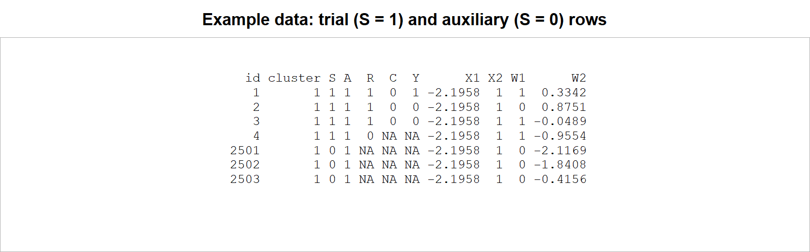
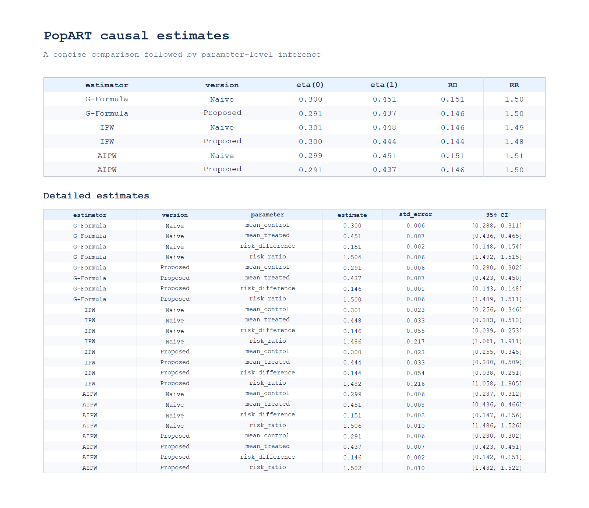
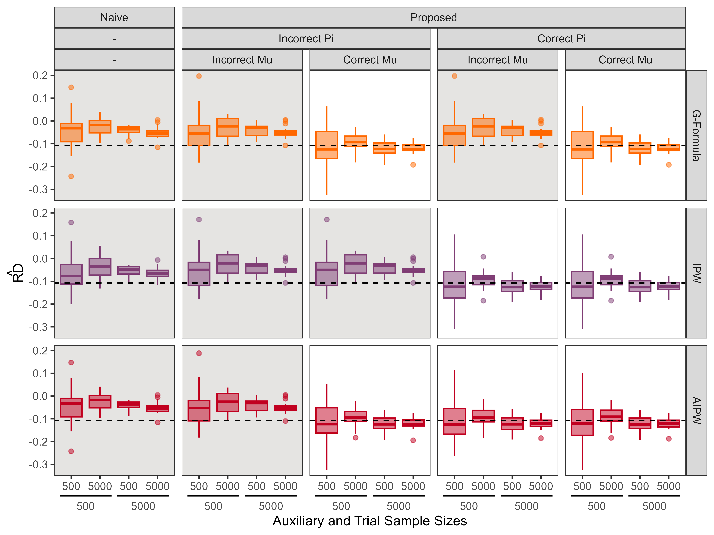
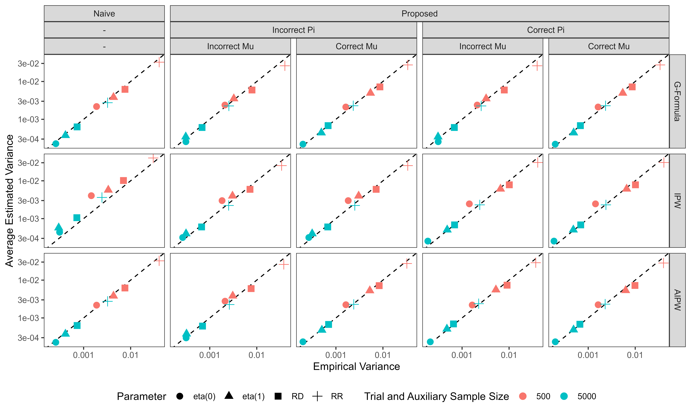
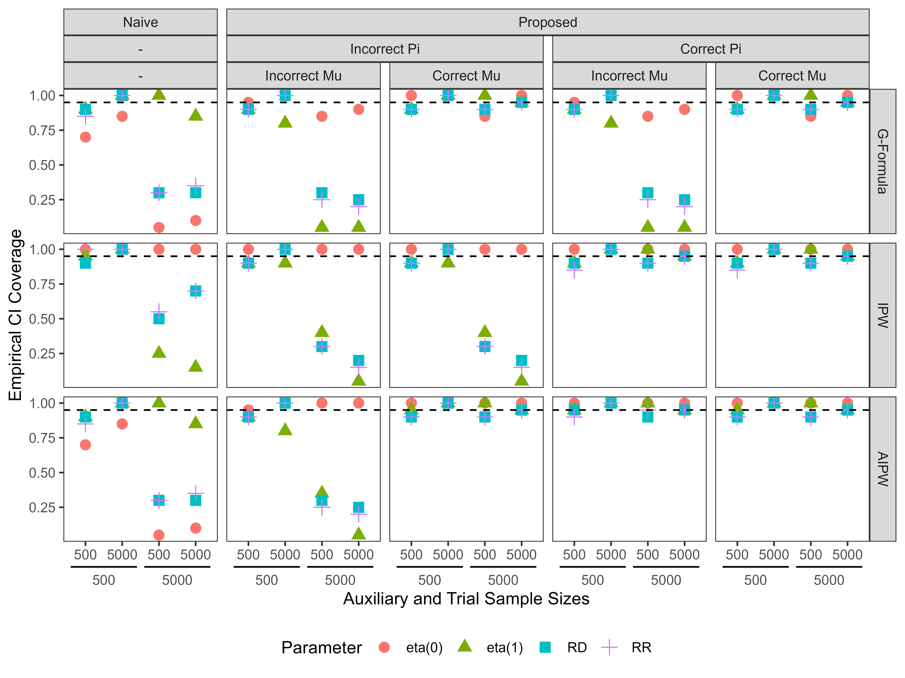
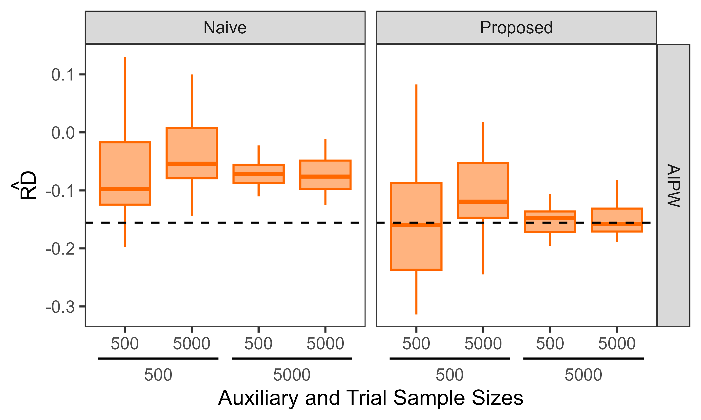
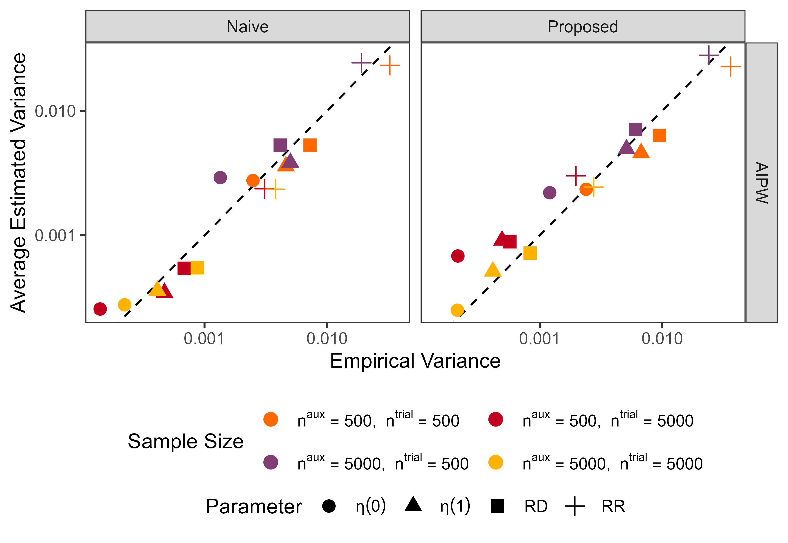
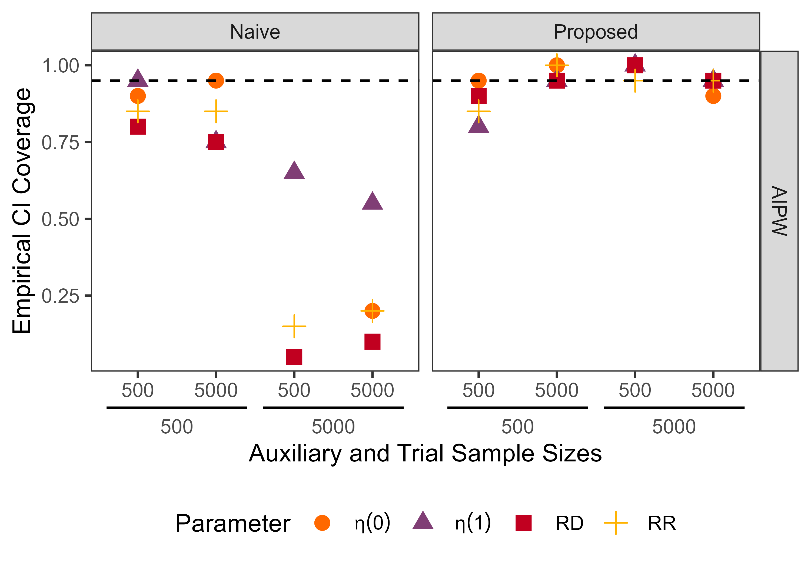

# popart: Causal Inference for Cluster-Randomized Trials with Differential Nonresponse

## Background and data structure

### Background

`popart` estimates population-level causal effects from a cluster-randomized
trial with differential individual nonresponse and outcome censoring.

| Design feature | Statistical role |
|---|---|
| Cluster-level treatment | Every individual in a randomized cluster receives the same treatment assignment |
| Individual response | Only some invited individuals respond and provide individual-level data |
| Outcome censoring | A responder's outcome may remain unobserved |
| Auxiliary sample | Supplies the baseline covariate distribution of the target population |

If response differs by treatment or baseline covariates, complete trial cases
may not represent the population in the randomized clusters. The proposed
estimators combine observed trial outcomes with the auxiliary covariates to
address this selection problem.

For binary outcomes, the causal targets are:

| Parameter | Definition | Meaning |
|---|---|---|
| `eta(0)` | `E[Y(0)]` | Population risk if all clusters received control |
| `eta(1)` | `E[Y(1)]` | Population risk if all clusters received treatment |
| `RD` | `eta(1) - eta(0)` | Causal risk difference |
| `RR` | `eta(1) / eta(0)` | Causal risk ratio |

### Data structure

The package receives trial and auxiliary data frames separately. The example
CSV uses `S` to identify the two samples before splitting them.

| Variable | Level | Meaning | Trial | Auxiliary |
|---|---|---|---:|---:|
| `id` | Individual | Observation identifier | yes | yes |
| `cluster` | Cluster | Randomization unit | yes | yes |
| `S` | Individual | `1` = trial, `0` = auxiliary; used only to split the CSV | yes | yes |
| `A` | Cluster | Treatment assignment; constant within cluster | yes | not required |
| `R` | Individual | `1` = trial respondent | yes | no |
| `C` | Individual | `1` = censored outcome among respondents | yes | no |
| `Y` | Individual | Binary outcome, observed when `R = 1` and `C = 0` | yes | no |
| `X1`, `X2` | Cluster | Cluster-level baseline covariates | yes | yes |
| `W1`, `W2` | Individual | Individual-level baseline covariates | column required; responders used | yes |

**Required cluster structure:** within `trial_data`, every row with the same
`cluster` value must have the same non-missing treatment `A`. The auxiliary
sample does not need a treatment column. Data with treatment varying between
individuals in the same cluster do not match this cluster-randomized design.

Causal interpretation requires cluster randomization, positivity, sufficient
measured covariates for response and censoring, and a representative auxiliary
sample or valid auxiliary sampling weights.

## Installation

Run these commands from the `PopART_full` folder:

```r
install.packages(c("hal9001", "numDeriv", "data.table"))
install.packages(".", repos = NULL, type = "source")
library(popart)
```

The simulation scripts additionally use:

```r
install.packages(c(
  "dplyr", "tidyr", "ggplot2", "ggh4x", "legendry", "pkgload"
))
```

## Quick start

Open `example/run_analysis.R` and click **Run**, or run:

```r
source("example/run_analysis.R")
```

The script follows one short pipeline:

```r
library(data.table)
library(popart)

data <- fread("example/popart_example.csv", na.strings = "")
trial <- as.data.frame(data[S == 1])
auxiliary <- as.data.frame(data[S == 0])

fit <- fit_popart(
  trial_data = trial,
  auxiliary_data = auxiliary,
  outcome = "Y",
  treatment = "A",
  response = "R",
  censoring = "C",
  cluster = "cluster",
  covariates = c("X1", "X2", "W1", "W2")
)

print(fit)
summary(fit)
```

### Example data

The example contains 1,000,000 rows from 200 clusters: 500,000 trial rows and
500,000 auxiliary rows. It is stored as one CSV and split by `S` before
`fit_popart()` is called.

| Variable | Type and level | Example-data role |
|---|---|---|
| `id` | Integer; individual | Unique row identifier |
| `cluster` | Integer; cluster | Identifies the 200 randomized clusters |
| `S` | Binary; individual | `1` identifies trial rows; `0` identifies auxiliary rows |
| `A` | Binary; cluster | Treatment assignment, constant within each cluster |
| `R` | Binary; individual | Response indicator in trial rows; `NA` in auxiliary rows |
| `C` | Binary; individual | Censoring indicator for trial respondents; otherwise `NA` |
| `Y` | Binary; individual | Observed trial outcome; `NA` after nonresponse/censoring and in auxiliary rows |
| `X1` | Continuous; cluster | Baseline covariate, constant within cluster |
| `X2` | Binary; cluster | Baseline covariate, constant within cluster |
| `W1` | Binary; individual | Individual-level baseline covariate |
| `W2` | Continuous; individual | Individual-level baseline covariate |

The example is already analysis-ready: it does not require dummy-variable
creation, recoding, or an auxiliary weight.

The preview shows trial and auxiliary rows together. `NA` marks response,
censoring, and outcome fields that are unavailable for that row.



### Example output

`print(fit)` gives a concise comparison, while `summary(fit)` reports the
parameter-level estimates, standard errors, and 95% confidence intervals.
The upper table is the quick comparison and the lower table is the detailed
inference output.



## Important function, parameters, and algorithms

### Main function

Only one function is needed for a real-data analysis.

| Function | Purpose | Output |
|---|---|---|
| `fit_popart()` | Fit Naive and Proposed G-formula, IPW, and AIPW estimators | `estimates`, `variance`, and `covariance` |
| `print(fit)` | Display the six estimator/version combinations | `eta(0)`, `eta(1)`, `RD`, and `RR` |
| `summary(fit)` | Display all parameter-level results | Estimate, standard error, and 95% CI |

### Parameters of `fit_popart()`

| Parameter | Meaning | Default |
|---|---|---|
| `trial_data` | Trial observations | required |
| `auxiliary_data` | Auxiliary target-population observations | required |
| `outcome` | Binary outcome column | required |
| `treatment` | Cluster-level treatment column | required |
| `response` | Trial response indicator column | required |
| `censoring` | Outcome-censoring indicator column | required |
| `cluster` | Cluster identifier column | required |
| `covariates` | Shared cluster- and individual-level baseline covariates | required |
| `auxiliary_weight` | Optional auxiliary sampling-weight column | `NULL` |
| `treatment_values` | Control and treatment values | `c(0, 1)` |
| `treatment_probability` | Known probability of treatment assignment | `0.5` |
| `n_cv_folds` | Number of HAL cross-validation folds | `5` |
| `n_lambda_values` | Number of HAL lasso penalties | `50` |
| `random_seed` | Seed used to create cluster-grouped HAL folds | `1` |

### Returned results

| Element | Contents |
|---|---|
| `fit$estimates` | Estimates, standard errors, and 95% confidence limits |
| `fit$variance` | Estimated variance of each causal parameter |
| `fit$covariance` | Covariance matrix of `eta(0)` and `eta(1)` for each estimator/version |

### Algorithms

| Component | Implementation |
|---|---|
| Outcome regression | One HAL model fitted among uncensored trial responders |
| Censoring | One HAL model fitted among trial responders |
| Sample selection | Separate control- and treatment-arm HAL models using trial and auxiliary covariates |
| G-formula | Outcome predictions averaged over trial responders or the auxiliary target population |
| IPW | Complete outcomes weighted by observation or sample-selection probabilities |
| AIPW | Outcome regression combined with an inverse-probability correction |
| Fit reuse | Four HAL nuisance fits are shared by all six estimator/version combinations |
| Inference | Contributions are aggregated by cluster before covariance estimation |

| Version | Interpretation |
|---|---|
| Naive | Uses observed trial responders and ignores differential nonresponse |
| Proposed | Uses auxiliary covariates to represent the target population |

Each version reports `eta(0)`, `eta(1)`, `RD`, and `RR`, with standard errors
and 95% confidence intervals.

## Simulation 1: parametric model specification

### Purpose

Simulation 1 compares Naive and Proposed G-formula, IPW, and AIPW estimators
when the parametric outcome and selection models are correctly specified or
misspecified.

### DGP and settings

| Component | Setting |
|---|---|
| Clusters | 20; half assigned to control and half to treatment |
| Trial sizes | 500 and 5000 |
| Auxiliary sizes | 500 and 5000 |
| Monte Carlo replicates | 20 per sample-size combination |
| Cluster covariate | `X1`: fixed cluster-level risk |
| Individual covariates | `W1 ~ Bernoulli(0.5)` in trial; `W1 ~ Bernoulli(0.75)` in auxiliary; `W2 ~ Normal(0,1)` |
| Response | Binary; depends on the treatment-by-`W1` interaction; marginal rate 0.5 |
| Censoring | Binary; depends on treatment and `W1`; rate among responders 0.3 |
| Control outcome | `logit P(Y(0)=1) = -1 + 2W1 + 0.5W2 + 0.25X1` |
| Treated outcome | `logit P(Y(1)=1) = -W1 - 0.5W2` |

| Scenario | Correct model | Misspecified model |
|---|---|---|
| Outcome `mu` | Includes `X1`, `W1`, `W2`, treatment, and treatment interactions | Omits `W1` and its treatment interaction |
| Selection/censoring `pi` | Includes `X1`, `W1`, and `W2` | Omits `W1` |

### Generated data structure

Each replicate creates one trial sample and one auxiliary sample and combines
them into one internal data frame.

| Variable | Level | Trial rows (`S = 1`) | Auxiliary rows (`S = 0`) |
|---|---|---|---|
| `id` | Individual | Trial observation identifier | Auxiliary observation identifier |
| `cluster` | Cluster | Randomization unit | Corresponding target-population cluster |
| `X1` | Cluster | Fixed cluster risk | Same cluster risk |
| `W1` | Individual | Bernoulli with probability 0.50 | Bernoulli with probability 0.75 |
| `W2` | Individual | Standard normal | Standard normal |
| `A` | Cluster | Randomized treatment, constant within cluster | Retained only for the combined internal table |
| `R` | Individual | Generated response indicator | `0` placeholder |
| `C` | Individual | Generated censoring indicator | `0` placeholder |
| `Y` | Individual | Observed binary outcome; `0` placeholder when unobserved | `0` placeholder |
| `wt` | Individual | `1` | Auxiliary sampling weight determined by `W1` |
| `S` | Individual | `1` | `0` |

The auxiliary `R`, `C`, and `Y` values are placeholders and are not treated as
observed outcomes. The estimators use `S` to distinguish the two samples.

### Analysis pipeline

1. Generate one trial and one auxiliary sample.
2. Fit six estimators under four `mu`/`pi` specification scenarios.
3. Repeat for all four sample-size combinations.
4. Summarize bias, empirical variance, estimated variance, MSE, and 95% CI coverage.
5. Save the result table and three figures.

### Current results

The current 20-replicate run contains 1,920 estimator rows. It verifies the
complete pipeline but is not a final Monte Carlo study.

**RD estimates.** The boxplots show the Monte Carlo distribution of estimated
risk differences. The dashed line is the true RD; gray panels mark scenarios
in which the corresponding estimator is not expected to be consistent.



**Variance calibration.** Each point compares empirical variance with average
estimated variance. Points close to the dashed diagonal indicate agreement.



**Confidence-interval coverage.** Points show empirical coverage for
`eta(0)`, `eta(1)`, RD, and RR; the dashed line marks the nominal 95% level.



### Reproduction

Open `simulation/sim_scripts/ss1.R` and click **Run**. The script generates the
data, fits the estimators, summarizes the results, and writes all outputs.

| Output | Location |
|---|---|
| Result table | `simulation/sim_data/sim1/` |
| Figures | `simulation/sim_figures/sim1/` |

## Simulation 2: HAL AIPW with the global scheduler

### Purpose

Simulation 2 compares Naive and Proposed AIPW estimators when nonlinear
response, censoring, and outcome functions are learned with HAL. It also tests
the global scheduler used to distribute HAL fits across Monte Carlo replicates.

### DGP and settings

| Component | Setting |
|---|---|
| Clusters | 20; half assigned to control and half to treatment |
| Trial sizes | 500 and 5000 |
| Auxiliary sizes | 500 and 5000 |
| Monte Carlo replicates | 20 per sample-size combination |
| Cluster covariate | `X1`: fixed cluster-level risk |
| Individual covariates | `W1` binary; `W2` and `W3` standard normal |
| Response | Nonlinear in treatment, `W1`, `W2`, and `W3`; marginal rate 0.5 |
| Censoring | Nonlinear in treatment, `W1`, `W2`, and `W3`; rate among responders 0.3 |
| Control outcome | Nonlinear risk depending on `W1` |
| Treated outcome | Nonlinear risk depending on `W1`, `sin(W2)`, `W3^2`, and `X1` |
| Estimators | Naive HAL AIPW and Proposed HAL AIPW |

### Generated data structure

Each replicate uses the same trial/auxiliary layout as Simulation 1, with an
additional nonlinear individual covariate `W3`.

| Variable | Level | Trial rows (`S = 1`) | Auxiliary rows (`S = 0`) |
|---|---|---|---|
| `id` | Individual | Trial observation identifier | Auxiliary observation identifier |
| `cluster` | Cluster | Randomization unit | Corresponding target-population cluster |
| `X1` | Cluster | Fixed cluster risk | Same cluster risk |
| `W1` | Individual | Bernoulli with probability 0.50 | Bernoulli with probability 0.75 |
| `W2`, `W3` | Individual | Independent standard normal covariates | Independent standard normal covariates |
| `A` | Cluster | Randomized treatment, constant within cluster | `0` placeholder |
| `R` | Individual | Nonlinear response indicator | `0` placeholder |
| `C` | Individual | Nonlinear censoring indicator | `0` placeholder |
| `Y` | Individual | Observed binary outcome; `0` placeholder when unobserved | `0` placeholder |
| `wt` | Individual | `1` | Mean-one auxiliary sampling weight determined by `W1` |
| `S` | Individual | `1` | `0` |

Again, auxiliary `A`, `R`, `C`, and `Y` are internal placeholders rather than
observed auxiliary variables. HAL is fitted with `X1`, `W1`, `W2`, and `W3`.

### Global scheduler

| Step | Operation |
|---|---|
| CPU detection | `global_fit_slots = detectCores(logical = TRUE) - 2` |
| Active replicates | `ceiling(global_fit_slots / 2)` |
| HAL jobs | Four shared fits per replicate |
| Parallelization | One global worker pool; no nested HAL backend |
| Memory control | Replicates are prepared and fitted in batches |

### Analysis pipeline

1. Generate nonlinear trial and auxiliary data.
2. Prepare four HAL jobs for each active replicate.
3. Fit all jobs through the global worker pool.
4. Reuse the fits for Naive and Proposed AIPW.
5. Summarize RD estimates, empirical and estimated variances, and 95% CI coverage.
6. Save the result table and three figures.

### Current results

The current 20-replicate run contains 160 estimator rows. It verifies the HAL
and scheduling pipeline but is not a final Monte Carlo study.

**RD estimates.** The boxplots compare Naive and Proposed HAL AIPW across the
four sample-size combinations. The dashed line is the true RD.



**Variance calibration.** Each point compares empirical variance with average
estimated variance for the four causal parameters. The dashed diagonal marks
perfect agreement.



**Confidence-interval coverage.** Points show empirical 95% CI coverage by
sample size and parameter; the dashed line marks the nominal 0.95 level.



### Reproduction

Open `simulation/sim_scripts/ss2.R` and click **Run**. CPU allocation, HAL
fitting, result summaries, and figure generation are handled by the script.

| Output | Location |
|---|---|
| Result table | `simulation/sim_data/sim2/` |
| Figures | `simulation/sim_figures/sim2/` |

## References

<!-- References will be added later. -->
